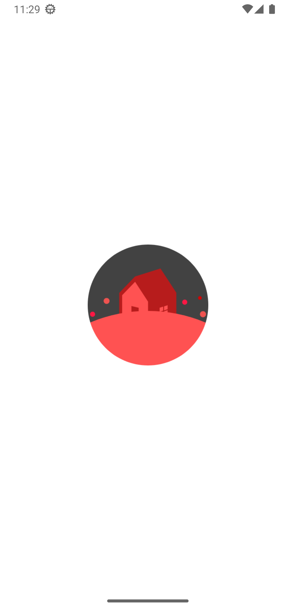
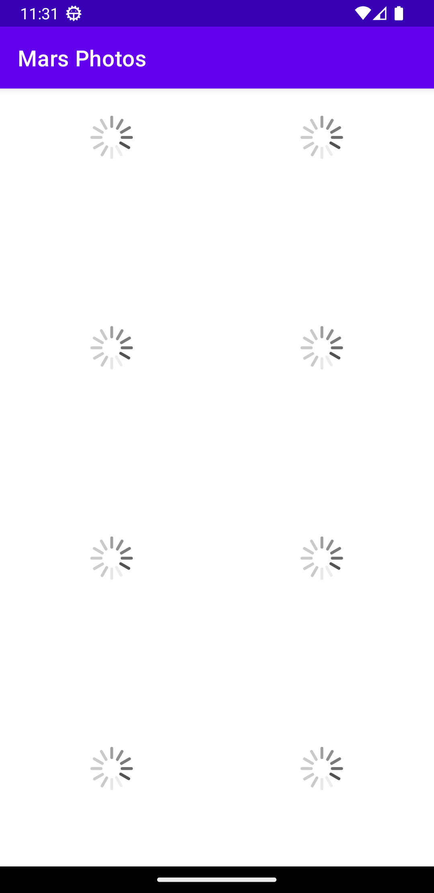
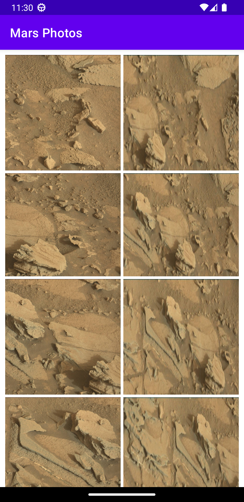

# Mars Photo Viewer

An Android app built in Kotlin that displays real Mars rover photos from NASA's public REST API.

This project demonstrates the use of modern Android development practices, including:

- **Retrofit** for making RESTful API calls
- **Moshi** for parsing JSON into Kotlin data classes
- **Coil** for efficient image loading
- **ViewModel** and **LiveData** for lifecycle-aware data handling
- **Coroutines** for background network operations
- **Data Binding** with custom binding adapters for cleaner UI logic

## 📚 What I Learned

While building this app, I deepened my understanding of:
- Asynchronous programming with coroutines and lifecycle-aware components
- Structuring apps using Android’s recommended MVVM architecture
- Networking best practices in Android apps
- Efficient image handling and caching
- Declarative UI binding using XML + Data Binding

## 🔧 Tech Stack

- Language: Kotlin  
- Architecture: MVVM  
- Networking: Retrofit + Moshi  
- Image Loading: Coil  
- Lifecycle: ViewModel, LiveData  
- UI: XML Layouts with Data Binding  
- Concurrency: Kotlin Coroutines  

## 📸 Screenshots

| Home Screen | Loading State | Image Detail |
|-------------|----------------|---------------|
|  |  |  |

> _Make sure to replace these with your actual screenshots stored in a `screenshots/` folder in your repo._

## 🚀 Getting Started

To run this app locally:

1. Clone the repository  
2. Open in Android Studio  
3. Build and run on an emulator or physical device with internet access

---

## 🌐 API Source

This app uses NASA’s [Mars Rover Photos API](https://api.nasa.gov/) to fetch real-time rover images.

---

Let me know if you'd like help writing a project description for GitHub (above the repo), or if you want to auto-generate the screenshots with `adb` or emulator tools!
